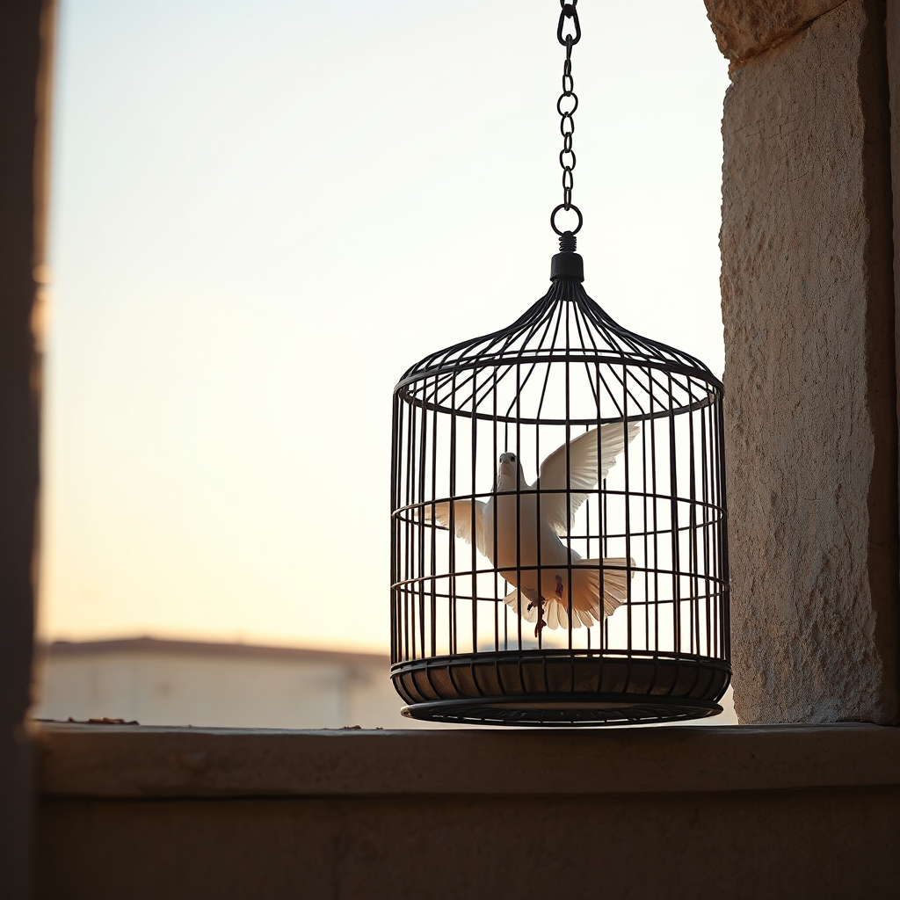
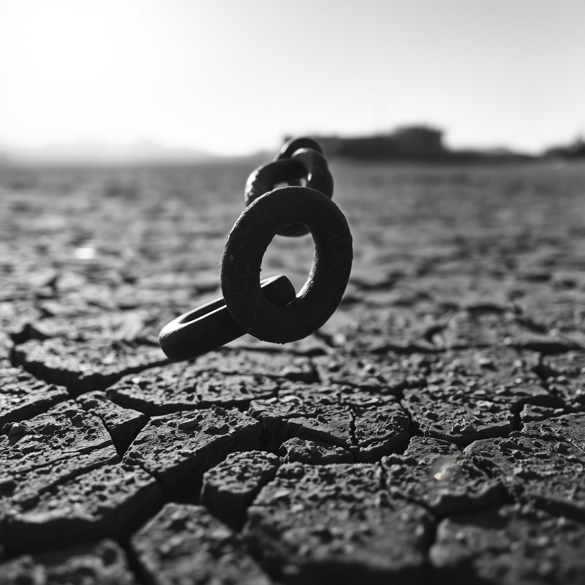
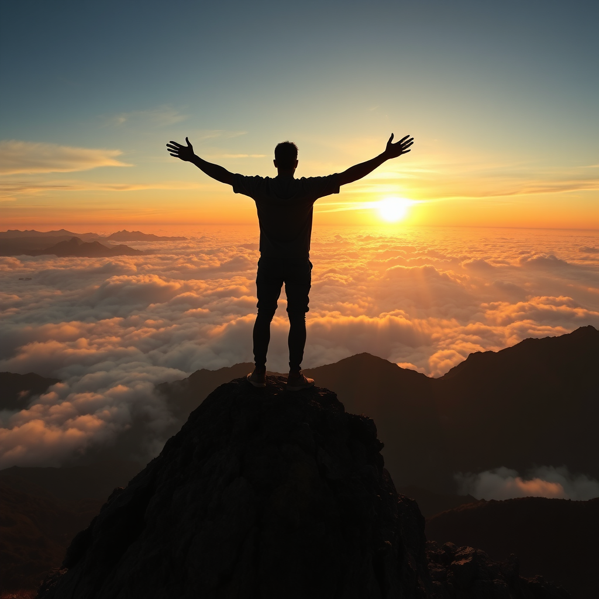

# PREVIEW — Publication "Liberté"

Format : preview brute (image + texte), sans mise en page ni habillage. La mise en page définitive n'interviendra qu'après validation de l'auteur (Phase 2). Cette preview sert uniquement à valider le contenu (photos, prompts, textes) avant d'aller plus loin.

Thème : **Liberté**
Nombre d'articles : 3
Outil de génération : ShowMe5WH (ComfyUI, en local sur le Mac mini)
Statut : en attente de validation de l'auteur — aucune mise en ligne, aucune suite (Phase 2) sans accord explicite.

---

## Article 1 — L'instant avant l'envol

**Prompt (français) :** Photographie photoréaliste : une colombe blanche s'échappant d'une cage en fer forgé restée grande ouverte, posée sur le rebord d'une fenêtre en pierre ancienne, à l'aube. Elle prend son envol vers un ciel dégagé baigné de lumière dorée. Lumière douce et chaude, faible profondeur de champ, cage nette au premier plan légèrement floue, ciel net et lumineux en arrière-plan, composition selon la règle des tiers.

**Modèle de génération :** Flux.1 Schnell (mflux, 4-bit) via ShowMe5WH / ComfyUI

**Texte :**

La porte de la cage est ouverte. Rien ne retient plus la colombe — et pourtant, elle est encore là, ailes déployées, suspendue entre deux mondes. C'est peut-être l'image la plus juste de la liberté : non pas l'évasion elle-même, mais la seconde qui la précède, celle où l'on comprend qu'on peut partir.

La liberté commence rarement par un mouvement spectaculaire. Elle commence par une porte qu'on n'avait pas remarquée ouverte, une contrainte qui n'existe plus que dans l'habitude qu'on en a gardée. La cage, ici, ne retient plus rien — elle ne fait plus que porter le souvenir d'un enfermement.

Le ciel doré à l'arrière-plan n'est pas encore atteint. Il est promis. Et c'est peut-être ça, être libre : avoir un horizon vers lequel s'élancer, et le savoir accessible.

---

## Article 2 — Le dernier maillon

**Prompt (français) :** Photographie noir et blanc argentique : gros plan sur le dernier maillon d'une chaîne métallique rouillée, brisé net, posé sur un sol de terre aride craquelée, sous une lumière dure de fin d'après-midi qui projette une ombre longue. À l'horizon flou, un paysage désertique s'ouvre à perte de vue. Grain de pellicule visible, fort contraste, netteté sur le maillon brisé au premier plan.

**Modèle de génération :** Flux.1 Schnell (mflux, 4-bit) via ShowMe5WH / ComfyUI

**Texte :**

Il ne reste qu'un anneau, rompu, posé sur une terre craquelée par la sécheresse. Le reste de la chaîne s'étire encore vers l'arrière-plan, floue, presque oubliée — elle a cessé d'avoir de l'importance à l'instant où ce maillon a cédé.

La liberté n'efface pas ce qui a précédé. Elle laisse des traces : un sol aride, une lumière dure, une ombre longue qui rappelle combien le chemin a été âpre. Mais elle change tout, à partir d'un seul point de rupture. Il suffit d'un maillon.

Le noir et blanc, le grain, le silence de cette image parlent d'un affranchissement sans emphase : pas de poing levé, pas de foule — juste la preuve matérielle, posée au sol, qu'une entrave a fini par céder.

---

## Article 3 — Aucune limite

**Prompt (français) :** Photographie photoréaliste : une silhouette humaine seule, bras grands ouverts, debout au sommet d'une falaise rocheuse, face à un vaste paysage de montagnes et de nuages à perte de vue, en contre-jour au lever du soleil. Plan large, ciel embrasé de couleurs chaudes, sensation d'immensité et d'espace infini, personnage petit dans le cadre par rapport au paysage.

**Modèle de génération :** Flux.1 Schnell (mflux, 4-bit) via ShowMe5WH / ComfyUI

**Texte :**

Une silhouette, minuscule face à l'immensité, bras ouverts au sommet d'un monde de nuages et de montagnes. Rien ne l'entoure qu'un horizon sans bord — pas de mur, pas de plafond, pas de ligne d'arrivée.

C'est la forme la plus radicale de la liberté : celle qui n'a plus besoin d'être conquise contre quelque chose, parce qu'il n'y a plus d'obstacle en vue. Le personnage n'a pas fui une cage, il n'a pas rompu de chaîne — il est simplement monté assez haut pour découvrir que l'espace était plus vaste qu'il ne l'imaginait.

Le contre-jour efface les détails du visage : ce pourrait être n'importe qui. C'est précisément le sens de cette image — la liberté d'être à cet endroit, dans cette posture, appartient à quiconque a le courage de grimper jusque-là.

---

## Question pour l'auteur

Cette preview valide-t-elle le **contenu** (3 photos, prompts, textes) de la publication "Liberté" ?

- Si oui → passage en Phase 2 (choix de la stack du site + mise en page/habillage définitif), puis nouvelle validation avant toute mise en ligne.
- Si des ajustements sont nécessaires (régénération d'une photo — 3 tentatives max par article, retouche d'un texte, ajout/suppression d'un article) → à préciser article par article.
