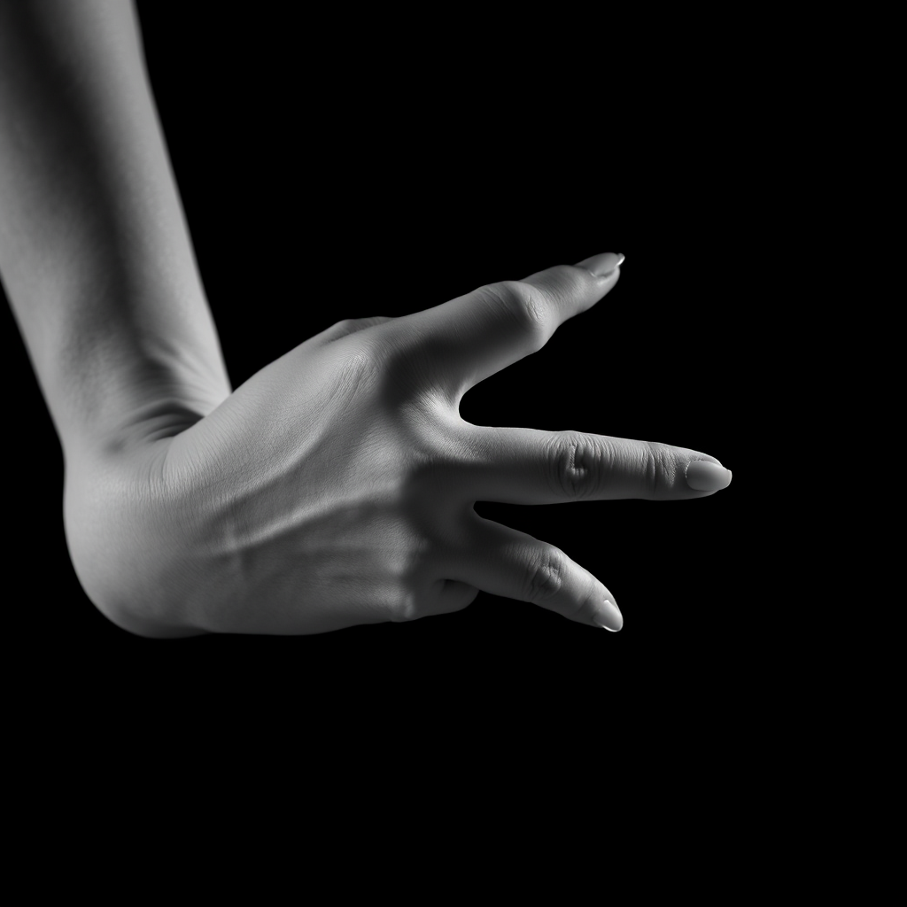
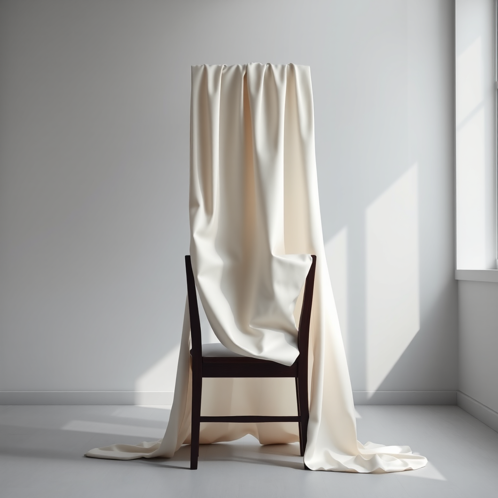
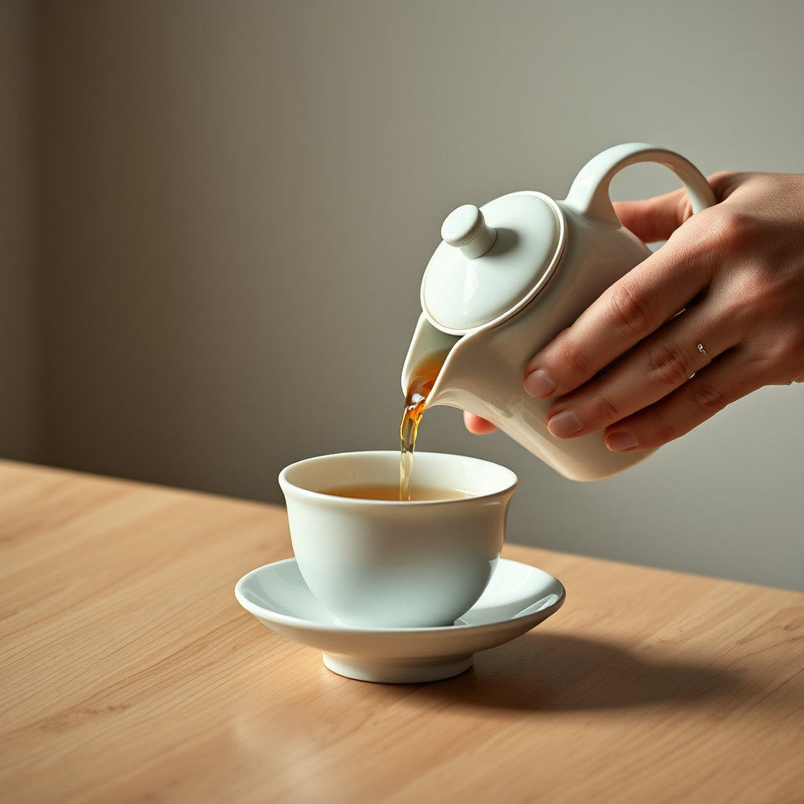

# PREVIEW — Publication "Élégance"

Format : preview brute (image + texte), sans mise en page ni habillage. La mise en page définitive n'intervient qu'après cette étape. Cette preview sert uniquement à valider le contenu (photos, prompts, textes) avant la mise en ligne.

Thème : **Élégance**
Nombre d'articles : 3
Outil de génération : ShowMe5WH (ComfyUI, en local sur le Mac mini)
Statut : preview prête — en attente de l'accord de l'auteur pour la mise en ligne (aucune publication publique sans validation explicite).

---

## Article 1 — Le geste suspendu

**Prompt (français) :** Photographie photoréaliste en noir et blanc : gros plan sur la main et l'avant-bras d'une danseuse de ballet, doigts fins et gracieux en pointe, poignet légèrement cambré, sur fond noir uni. Éclairage latéral dramatique en clair-obscur, peau texturée avec précision, netteté extrême sur les doigts, arrière-plan totalement sombre et épuré.

**Modèle de génération :** Flux.1 Schnell (mflux, 4-bit) via ShowMe5WH / ComfyUI

**Texte :**

Rien ici ne cherche à impressionner. Une main, un avant-bras, quatre doigts déployés dans le noir — et pourtant l'œil ne voit que la tenue du geste, cette manière de s'arrêter net à l'instant précis où le mouvement aurait pu devenir désordre.

L'élégance ne se loge pas dans l'ornement. Elle est dans le contrôle : cette capacité à faire beaucoup avec très peu, à tenir une pose sans qu'elle paraisse tenue. La main de la danseuse ne fait rien d'exceptionnel — elle refuse simplement le geste de trop.

Le fond noir absorbe tout ce qui n'est pas essentiel. Ne reste que la ligne, la tension du poignet, la précision du bout des doigts. C'est peut-être la définition la plus juste de l'élégance : ce qui subsiste quand on a retiré tout le superflu.

---

## Article 2 — Le pli parfait

**Prompt (français) :** Photographie photoréaliste en studio : un drapé de soie ivoire tombant en plis fluides et sculpturaux sur le dossier d'une chaise en bois sombre, dans une pièce minimaliste aux murs gris clair. Lumière douce et directionnelle venant d'une fenêtre haute, ombres longues et nettes, texture soyeuse visible, composition épurée, aucune présence humaine.

**Modèle de génération :** Flux.1 Schnell (mflux, 4-bit) via ShowMe5WH / ComfyUI

**Texte :**

Une chaise, un tissu, une lumière qui tombe d'une fenêtre haute. Aucun personnage, aucune mise en scène — seulement la manière dont une étoffe choisit de retomber, avec une évidence qui semble presque calculée.

L'élégance, souvent, se donne à voir dans ce qui n'a l'air de rien : un pli qui trouve sa place plutôt qu'une autre, une matière qui obéit à la gravité avec grâce au lieu de simplement s'affaisser. La soie ne fait ici aucun effort visible. C'est précisément ce qui la rend élégante.

Il y a quelque chose de rassurant dans cette image dénuée de présence humaine : l'élégance n'a pas besoin d'être portée pour exister. Elle tient dans l'objet seul, dans la justesse d'une forme qui n'a rien à prouver à personne.

---

## Article 3 — Le rituel du thé

**Prompt (français) :** Photographie photoréaliste : gros plan sur des mains âgées et fines versant du thé depuis une théière en porcelaine blanche vers une tasse assortie, sur une table en bois clair. Lumière naturelle douce venant de la gauche, vapeur légère visible au-dessus de la tasse, arrière-plan flou et neutre, attention portée à la précision du geste et à la retenue du mouvement.

**Modèle de génération :** Flux.1 Schnell (mflux, 4-bit) via ShowMe5WH / ComfyUI

**Texte :**

Un filet de thé qui coule, une main qui ne tremble pas, un geste répété tant de fois qu'il en devient presque automatique — et pourtant chaque détail semble pesé : l'angle de la théière, la hauteur du versement, le silence autour.

L'élégance n'est pas réservée à l'exceptionnel. Elle habite aussi les gestes du quotidien, quand ils sont faits avec une attention qui les élève au-dessus de la simple fonction. Verser du thé n'a rien de spectaculaire ; le faire avec cette retenue précise, si.

Ce que cette photo capture, c'est moins l'objet que le tempo : la lenteur assumée d'un geste qu'on aurait pu bâcler et qu'on choisit, au contraire, d'accomplir pleinement. L'élégance, peut-être, est avant tout une question de rythme.
